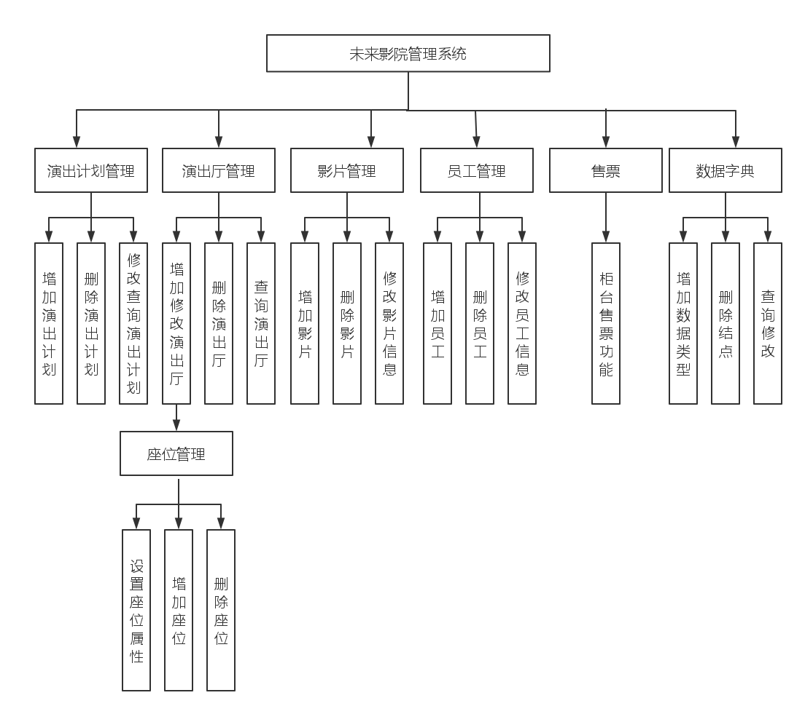
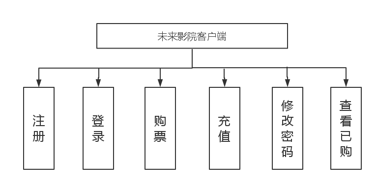
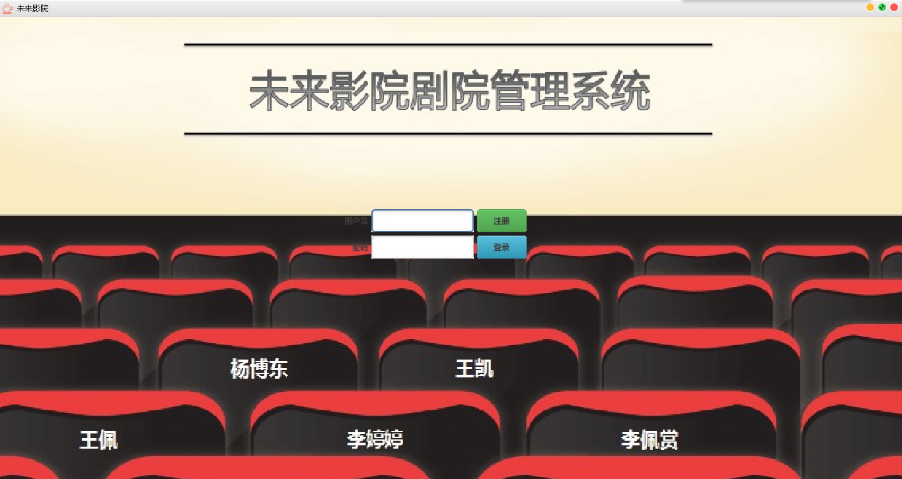
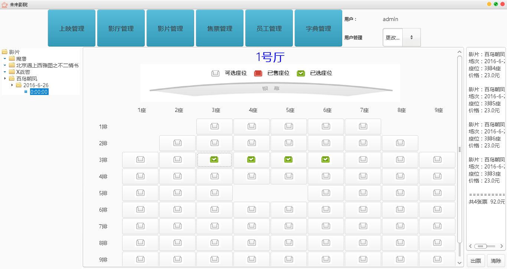
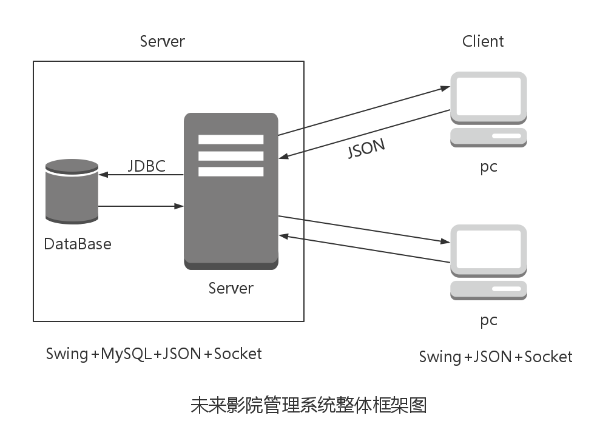

# TTMS (Theater Ticket Management System)

`TTMS`全称`剧院票务管理系统`,分为客户端和服务器端。服务器端可以接收客户端连接请求，客户端相当于我们个人PC或者移动终端，通过这套系统我们可以完成对一个影院的票务管理。  

服务器端功能如下：

客户端功能如下：

# 环境需求

- jre(jdk)
- MySQL
- Linux(Socket)

# 快速安装

1：启动MySQL服务器，运行`TTMS_clerk/resource/database/TTMSCreate.sql`,创建数据库，默认为`TTMS`。  
2：配置`TTMS_clerk/resource/database/jdbc.properties`中数据库`登录用户`和`密码`。  
3：运行`TTMS_clerk/resource/database/TTMSInsertData.sql`插入开发测试数据。(可插可不插)  
4：运行服务器端`TTMS_clerk/src/xupt/se/ttms/main/main.java`，启动服务器。  
5：运行客户端`TTMS_Client/src/control/main.java`连接服务器时候保证`端口`和`IP`是正确的。  

# 效果展示

## 服务器端运行截图：  
  
###  登录
  
### 售票管理
  

## 客户端运行截图：

### 正在上映
  

# 体系结构

  

服务器端：界面采用Java Swing 开发，数据库采用MySQL,数据库连接工具采用JDBC，Scoket通信，Json为数据传递格式。  

客户端：界面采用Java Swing 开发，Socket通信。  

# 遇到的问题

1：两人同时买一张票
解决方案：采用数据库事务机制，如果没有票再生成，否则失败，但是这样不太友善，因为用户已经选好座了，买票时候却没有了，友善的处理方式是给票加锁，锁定座位的时候就去判断座位是不是被别人锁定了。  

2：Json时间格式问题  

# 待解决的问题
1：数据库中票加锁问题  
2：用存储过程、数据库连接池等提高服务器效率。    

# 版本

